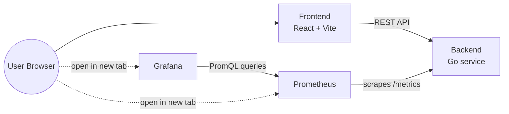

# Observability Demo Platform

A control panel for watching observability tooling do its job in real time. Click a button, generate traffic or load, and watch it appear on live Prometheus and Grafana dashboards within seconds.



## Stack

- **Frontend:** React + Vite
- **Backend:** Go
- **Metrics:** Prometheus
- **Dashboards:** Grafana
- **Local orchestration:** Docker Compose
- **Deployment:** Render (AWS/GCP path documented for later)

## Quick Start

```bash
docker compose -f infra/docker-compose.yml up --build
```

Then open:

- Control panel: [http://localhost:5173](http://localhost:5173)
- Prometheus: [http://localhost:9090](http://localhost:9090)
- Grafana: [http://localhost:3000](http://localhost:3000)

## Documentation

Full project documentation lives in [`/docs`](docs/):

| Document | What it covers |
|----------|-----------------|
| [PROJECT_OVERVIEW.md](docs/PROJECT_OVERVIEW.md) | What this is, goals, non-goals, feature list |
| [ARCHITECTURE.md](docs/ARCHITECTURE.md) | Component responsibilities, data flow, design constraints |
| [API_SPEC.md](docs/API_SPEC.md) | REST contract between frontend and backend |
| [BACKEND.md](docs/BACKEND.md) | Backend structure, load-generator state machine |
| [OBSERVABILITY.md](docs/OBSERVABILITY.md) | Metrics catalog, Prometheus config, Grafana dashboards |
| [FRONTEND.md](docs/FRONTEND.md) | Control panel structure and behavior |
| [DOCKER.md](docs/DOCKER.md) | Local Compose topology and dev workflow |
| [DEPLOYMENT.md](docs/DEPLOYMENT.md) | Render deployment, future AWS/GCP path |
| [ROADMAP.md](docs/ROADMAP.md) | Phased delivery plan and task checklist |
| [DECISIONS.md](docs/DECISIONS.md) | Architecture decision log |

## Status

This project is currently in **Phase 1 — Documentation** (see [ROADMAP.md](docs/ROADMAP.md)). No application code has been written yet; the `/docs` folder is the complete plan for what comes next.
