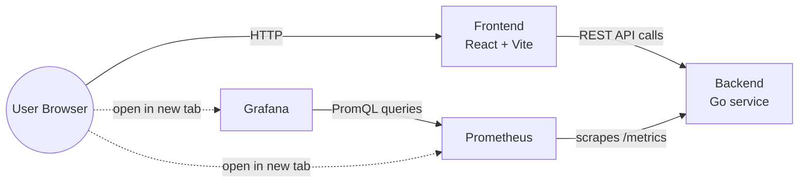
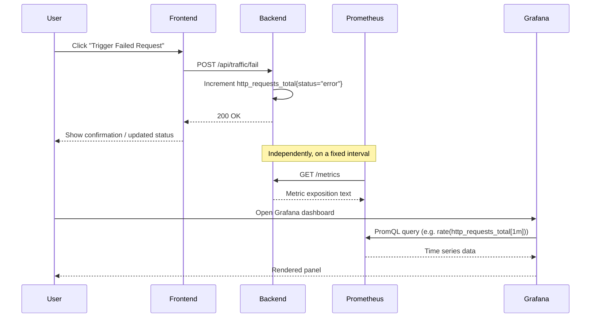
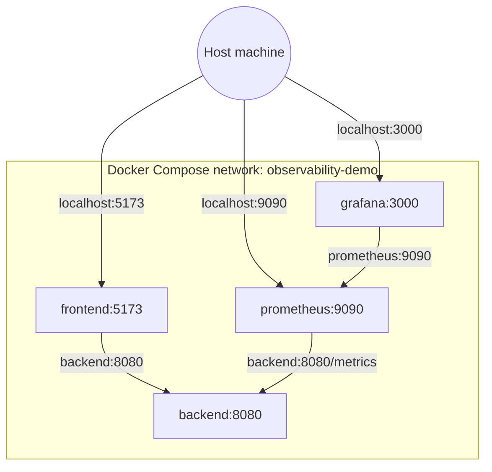

# Architecture

## Overview

Four components make up the system: a React frontend, a Go backend, Prometheus, and Grafana. The frontend talks only to the backend. Prometheus scrapes the backend directly. Grafana queries Prometheus. The frontend also links out to Prometheus and Grafana's own UIs, but does not embed or proxy them.

## Component Responsibilities

| Component | Responsibility | Does NOT do |
|-----------|-----------------|-------------|
| Frontend | Render control panel, call backend REST API, poll and display status, link out to Prometheus/Grafana | Query Prometheus directly, render dashboards itself |
| Backend | Own load-generator state machine, expose REST API, expose `/metrics` and `/health` | Persist state, authenticate users, talk to Prometheus/Grafana directly |
| Prometheus | Scrape backend metrics on an interval, store time series, serve PromQL queries | Push-based collection, alerting/paging |
| Grafana | Query Prometheus, render dashboards | Store its own metrics data, call the backend |

## Data Flow

The control-panel action and the dashboard update are decoupled: the action happens instantly against the backend, but the dashboard only reflects it after Prometheus's next scrape (see [OBSERVABILITY.md](OBSERVABILITY.md) for the configured interval).

## Request Lifecycle: A Single Control Panel Action

Using "Generate CPU Load" as the representative example:

1. User clicks the button in the frontend.
2. Frontend sends `POST /api/load/cpu` to the backend (see [API_SPEC.md](API_SPEC.md)).
3. Backend spins up CPU-bound work for a fixed duration in a background goroutine and returns `202 Accepted` immediately (it does not block the HTTP response on the load finishing).
4. Backend updates a `cpu_load_active` gauge to `1` while the work runs, and back to `0` when it finishes.
5. Frontend polls `GET /api/status` to reflect the current state in the UI.
6. Prometheus scrapes `/metrics` on its interval and captures whatever the gauge's value was at that instant.
7. A Grafana panel querying `cpu_load_active` shows the spike.

## Docker Network Topology

All four services join a single user-defined bridge network. Service names double as DNS hostnames (`backend`, `prometheus`, `grafana`, `frontend`) inside the network. Only the ports needed for direct human access (frontend, Prometheus UI, Grafana UI) are published to the host; the backend's `8080` is reachable from Prometheus/frontend over the internal network without being published, though it is published in local dev for convenience (see [DOCKER.md](DOCKER.md)).

## Design Constraints

- **Demo-scale, not production-scale.** No horizontal scaling, no load balancer, no database. A single backend instance is sufficient and intentional.
- **In-memory state.** The load-generator state (running/idle, counters) lives in a single Go process's memory. Restarting the backend resets it. This is acceptable because state persistence isn't part of what the demo teaches.
- **No authentication.** Every endpoint is open. This is a deliberate scope cut (see [DECISIONS.md](DECISIONS.md)), not an oversight — adding auth would add complexity without adding observability teaching value.
- **Synchronous control, asynchronous effects.** Control panel actions return quickly; any generated load (CPU, memory, traffic bursts) runs in the background so the UI stays responsive.

## Failure Modes

| Failure | Symptom | Why it's acceptable for a demo |
|---------|---------|--------------------------------|
| Backend restarts | All counters reset to zero, load generation stops | Documented behavior, not a bug; a real reset button exists too |
| Prometheus can't reach backend | Dashboards show gaps or "No Data" | Network/config issue, covered in the troubleshooting section of [OBSERVABILITY.md](OBSERVABILITY.md) |
| Grafana can't reach Prometheus | Dashboards fail to load panels | Same as above; data source misconfiguration is the usual cause |
| Frontend can't reach backend | Control panel shows an error state on action/status calls | Frontend should surface this clearly rather than fail silently |

## Related Documents

- [PROJECT_OVERVIEW.md](PROJECT_OVERVIEW.md) — goals and scope this architecture serves
- [API_SPEC.md](API_SPEC.md) — the contract referenced in the request lifecycle above
- [OBSERVABILITY.md](OBSERVABILITY.md) — metrics, Prometheus, and Grafana detail
- [DOCKER.md](DOCKER.md) — concrete Compose implementation of the network topology above
- [DECISIONS.md](DECISIONS.md) — rationale behind the constraints listed above
