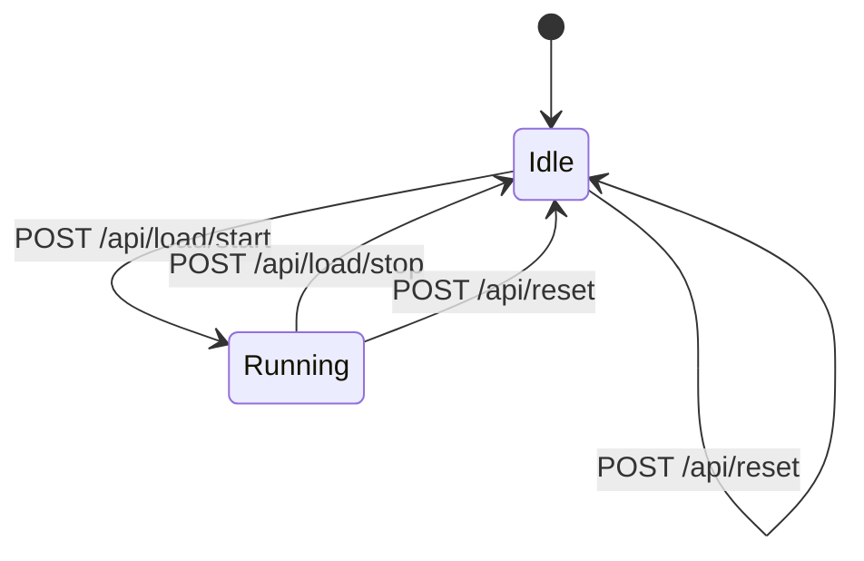

# Backend

## Overview

The backend is a Go service that implements the REST API in [API_SPEC.md](API_SPEC.md), holds the load-generator state machine, and exposes Prometheus metrics. Go is used for its low-overhead concurrency (goroutines make background load generation simple) and its first-class Prometheus client library, but nothing here is Go-specific in principle — see [ARCHITECTURE.md](ARCHITECTURE.md) for the language-agnostic contract.

## Package Layout

```
backend/
├── cmd/
│   └── server/          # main package, wires everything together
├── internal/
│   ├── api/             # HTTP handlers, routing
│   ├── loadgen/          # load-generator state machine and workers
│   ├── metrics/           # Prometheus metric definitions and registration
│   └── config/           # env var parsing
└── go.mod
```

`internal/` is used throughout since none of this is intended to be imported by other projects.

## Load-Generator State Machine



- **Idle** — no background traffic generation. Single request/CPU/memory actions can still be triggered independently of this state.
- **Running** — a background goroutine fires randomized traffic on a fixed interval until stopped.

CPU load and memory load are modeled as independent, self-terminating bursts rather than states in this machine — each runs for a fixed duration and clears itself, reflected as a boolean in `GET /api/status` (see [API_SPEC.md](API_SPEC.md)).

State lives in a single in-memory struct guarded by a mutex. No database, no persistence — see [ARCHITECTURE.md](ARCHITECTURE.md) for why this is an intentional constraint, not a shortcut.

## Health Check

`GET /health` returns `200 OK` as long as the process is running and able to respond — it does not check downstream dependencies, because the backend has none (Prometheus and Grafana depend on the backend, not the other way around).

## Metrics Instrumentation

The backend uses the official `prometheus/client_golang` library. Metrics are defined once in `internal/metrics` and incremented/updated from `internal/api` and `internal/loadgen` as actions occur. The full metric catalog lives in [OBSERVABILITY.md](OBSERVABILITY.md) — this doc only covers where instrumentation lives in the codebase.

## Configuration

All configuration is via environment variables, with sensible defaults for local development:

| Variable | Default | Purpose |
|----------|---------|---------|
| `PORT` | `8080` | HTTP listen port |
| `LOAD_INTERVAL_MS` | `1000` | Interval between background traffic events while running |
| `CPU_LOAD_DURATION_MS` | `5000` | How long a CPU load burst runs |
| `MEMORY_LOAD_DURATION_MS` | `5000` | How long a memory load burst holds allocated memory |
| `MEMORY_LOAD_MB` | `100` | How much memory a memory load burst allocates |

## Testing

Given the demo scope, testing focuses on the load-generator state machine (valid/invalid transitions) and API handler behavior (status codes, response shapes) using Go's standard `testing` package and `net/http/httptest`. Exhaustive coverage isn't a goal — the aim is confidence that the state machine documented above matches its implementation.

## Related Documents

- [API_SPEC.md](API_SPEC.md) — the contract this service implements
- [OBSERVABILITY.md](OBSERVABILITY.md) — full metric catalog
- [ARCHITECTURE.md](ARCHITECTURE.md) — how this service fits into the whole system
