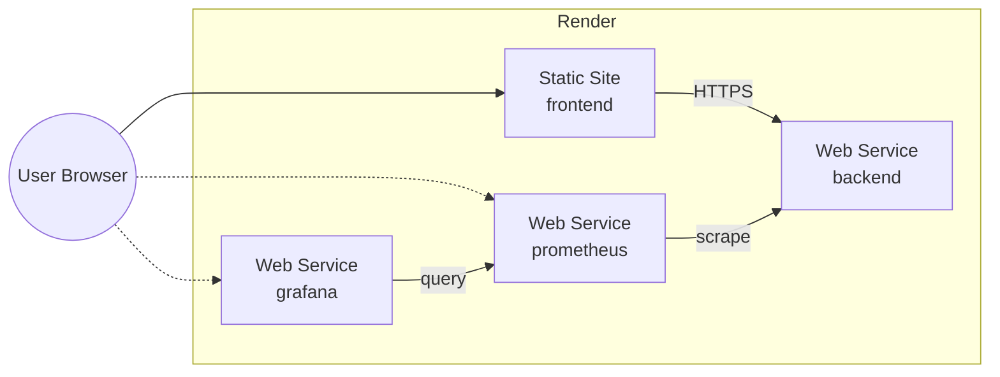

# Deployment

## Overview

The stack deploys to Render today, using the same four-service shape as local Docker Compose (see [DOCKER.md](DOCKER.md)). This document also sketches, at a conceptual level only, how the same architecture would map onto AWS or GCP later — no implementation work is planned for that until it's actually needed.

## Render Deployment Architecture

| Local Compose Service | Render Service Type | Notes |
|-------------------------|----------------------|-------|
| `frontend` | Static Site | Built via Vite, served as static assets |
| `backend` | Web Service | Standard Go binary, exposes `/api`, `/health`, `/metrics` |
| `prometheus` | Web Service (Docker) | Runs the official Prometheus image with the same scrape config as local dev |
| `grafana` | Web Service (Docker) | Runs the official Grafana image with the same provisioning as local dev |

Render assigns each service its own public hostname rather than a shared internal network, so URLs are configured via environment variables per service (below) instead of Docker DNS names.

## Environment Variables and Secrets

| Service | Variable | Source |
|---------|----------|--------|
| `frontend` | `VITE_BACKEND_URL` | Backend's Render URL |
| `frontend` | `VITE_PROMETHEUS_URL` | Prometheus's Render URL |
| `frontend` | `VITE_GRAFANA_URL` | Grafana's Render URL |
| `prometheus` | scrape target | Backend's Render URL, set in the scrape config deployed alongside the service |
| `grafana` | `GF_SECURITY_ADMIN_PASSWORD` | Render secret, not committed to the repo |

No secrets beyond the Grafana admin password exist in this system, since there's no authentication or third-party API integration in scope.

## Deploy Trigger

Render is configured to auto-deploy each service from pushes to the `main` branch. There is no separate CI pipeline in this phase — Render's own build step (Vite build for the frontend, Go build for the backend, Docker image pull for Prometheus/Grafana) is the entire deploy process.

## Future Cloud Strategy

This section is deliberately conceptual — no work is planned here until the project actually needs to move off Render.

**AWS:** Frontend as a static site on S3 + CloudFront. Backend as a container on ECS Fargate behind an Application Load Balancer. Prometheus and Grafana either self-hosted on Fargate (same containers as today) or replaced with Amazon Managed Service for Prometheus and Amazon Managed Grafana if operational overhead becomes a concern.

**GCP:** Frontend on Cloud Storage + Cloud CDN. Backend as a container on Cloud Run. Prometheus and Grafana self-hosted on Cloud Run or replaced with Google Cloud Managed Service for Prometheus plus a Grafana Cloud instance.

In both cases, the backend's `/metrics` endpoint and the Prometheus scrape-and-query model stay identical — the only thing that changes is where each container runs and how services discover each other, which keeps this migration low-risk whenever it happens.

## Related Documents

- [DOCKER.md](DOCKER.md) — the local topology this deployment mirrors
- [ARCHITECTURE.md](ARCHITECTURE.md) — the component responsibilities being deployed
